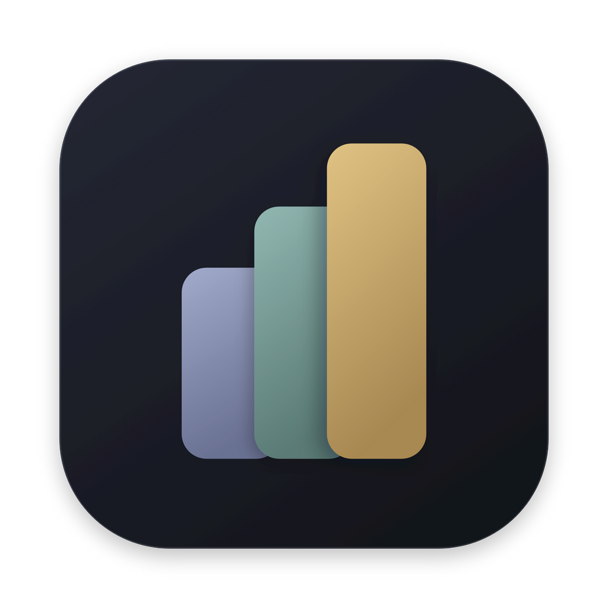
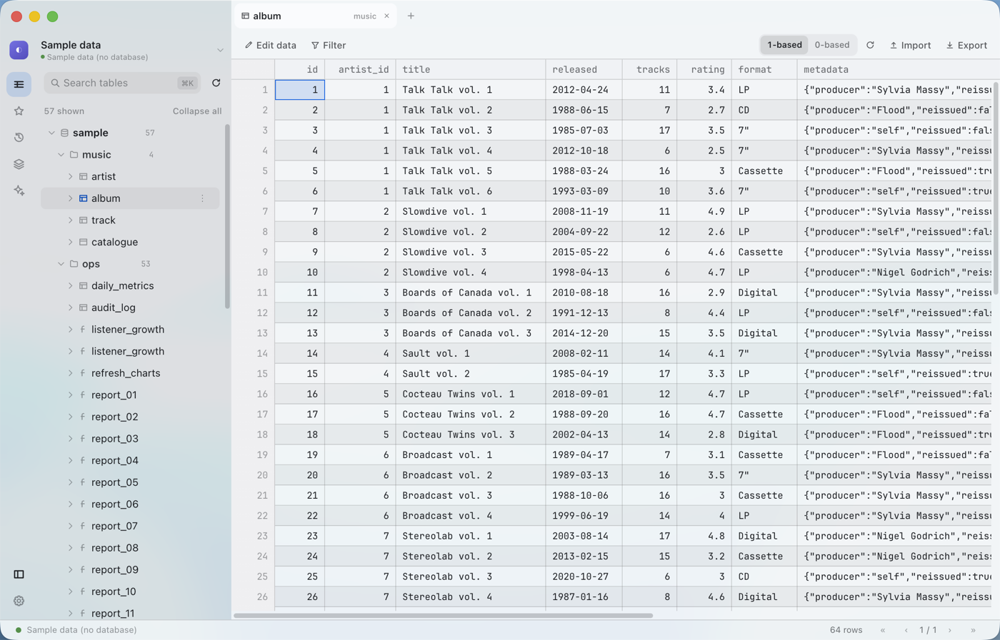
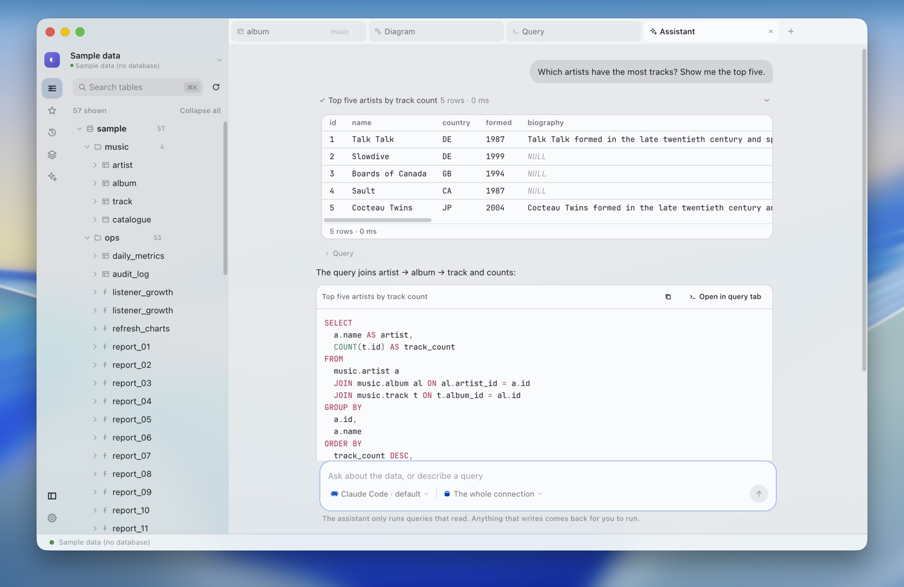
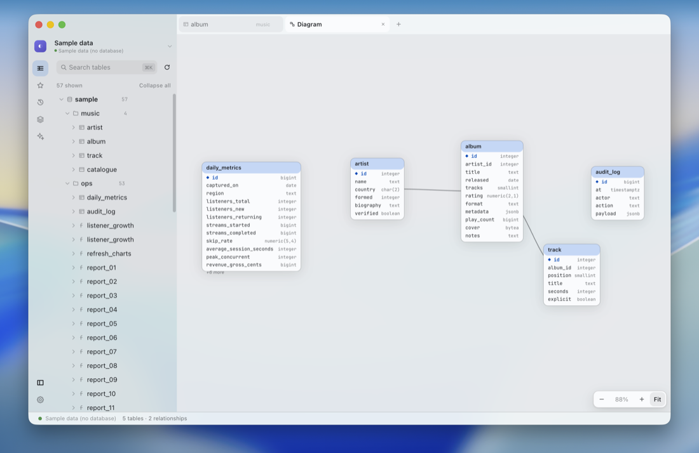
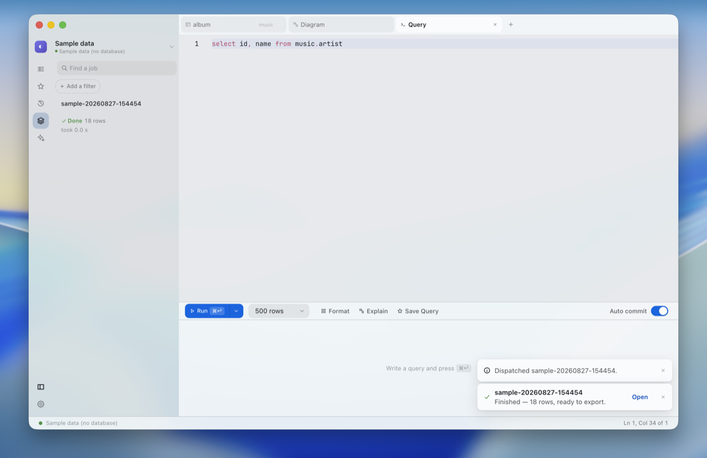
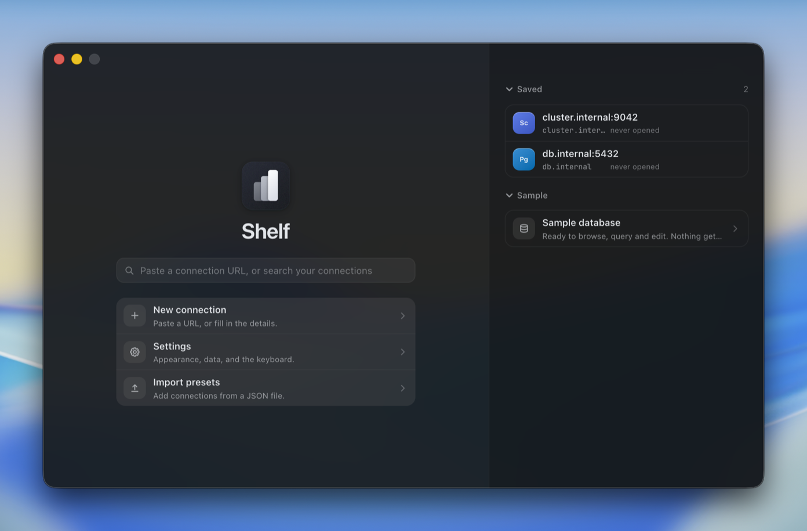

<p align="center">
  
</p>

<h1 align="center">Shelf</h1>

<p align="center">
  <strong>A database client with an interface worth looking at.</strong>
</p>

<p align="center">
  
  
  
</p>

<p align="center">
  
</p>

---

Shelf connects to nine database engines, shows your data in a spreadsheet-grade
grid, and lets you edit it. Every feature is available to everyone — no paid
tier, no licence key, no account, and no telemetry.

Desktop database clients tend to be either fast and ugly or pretty and slow, and
the ones that get close to both put their best features behind a licence. Shelf
is the version where the interface is actually designed, the information density
is high enough for real work, and nothing is withheld.

---

## Install

Download the latest build from [Releases](../../releases/latest).

| Platform | File | Notes |
| --- | --- | --- |
| macOS (Apple Silicon) | `.dmg` or `.zip` | Unsigned — see [Troubleshooting](#troubleshooting) |
| Windows | `Shelf Setup *.exe`, or the portable `.exe` | x64 |
| Linux | `.deb`, `.rpm` or `.AppImage` | x64; the packages install a desktop entry, the AppImage runs as it is |

Nothing asks for an account, and nothing phones home.

Opening the app gives you a start screen, not an empty workspace: paste a
connection URL and it fills in the form, or open the **sample database** — a
synthetic database with schemas, views, foreign keys, JSON, binary, big integers
and nulls. Everything works against it, and nothing is installed or saved.

---

## Engines

Every engine declares what it can do, so the interface adapts honestly instead
of showing controls that do nothing — DynamoDB has no column sort because it has
no column sort, and Redis has no transactions because it has none. **No
capability is ever tied to a licence, because there is no licence.**

| Engine | Query language | Notes |
| --- | --- | --- |
| PostgreSQL | SQL | Pooled, cursor streaming, server-side cancel, SSL, SSH tunnel |
| MySQL | SQL | Pooled, `KILL QUERY` cancel, timezone-safe dates, big-number-safe |
| TiDB | SQL | MySQL wire protocol, same driver |
| SQLite | SQL | File or in-memory, WAL |
| DuckDB | SQL | File or in-memory, cheap counts |
| MongoDB | `db.coll.find(…)` | Collections as entities, schema inferred by sampling |
| Redis | Redis commands | Keyspace browser with type, TTL, size and encoding |
| ScyllaDB | CQL | Keyspaces, token paging, batched writes |
| DynamoDB | PartiQL | Regions, key-aware editing, exclusive-start-key paging |

---

## What it does

- **Browse** — a schema tree that stays fast at tens of thousands of tables,
  with columns and types inline.
- **Read** — a spreadsheet-grade grid with range selection, paged reads, raw
  filtering, and a full-value inspector for anything wider than a cell.
- **Write** — inline editing that accumulates in a pending-changes ledger,
  previews as SQL, and applies in one transaction. A locked cell always says
  *why* it is locked.
- **Query** — a Monaco editor with schema-aware completion, the statement under
  the cursor highlighted, run-all or run-current, cancellation that reaches the
  server, multiple result sets, and manual transactions.
- **Dispatch** — send a statement off to run on its own: it releases the tab at
  once, keeps its whole answer on this machine, and says so when it is done. The
  hundred most recent are kept, searchable by name and narrowable by status,
  when they started, when they finished and how long they took.
- **Inspect** — columns with their descriptions, indexes, relations, triggers
  and partitions, each shown only where the engine has them.
- **Analyze** — for engines that keep statement statistics, the slowest queries
  over the last hour, day, week or all time, with each statement's share of the
  window; plus cache hit ratio, transaction rate, connections by state, the
  largest tables with their dead-row bloat, and indexes the planner has never
  chosen. No engine keeps a history, so the app records its own readings and
  says so when a window is wider than the history behind it.
- **Ask** — describe what you want in plain language and get the SQL.
  Right-click a table, a schema or a database and chat scoped to it: it reads
  your schema, runs read-only queries to check its own answer, and draws the
  rows it got back. Any statement can be lifted into a query tab.
  **It never writes.** Anything that would change data or shape comes back as a
  statement for you to run yourself.
- **Diagram** — a force-directed ERD with draggable, position-remembering nodes
  and relationship highlighting.
- **Change the shape** — add, rename and drop columns and indexes, with the
  statement shown before it runs and destructive changes requiring the object's
  name to be typed.
- **Explain** — a plan tree where node width and tint follow cost, so the
  expensive step is the one that stands out.
- **Move data** — import CSV, TSV, JSON or JSON Lines with columns matched by
  name; export CSV, JSON, JSONL or SQL, streamed straight to disk so the size of
  the table does not matter.
- **Keep** — saved queries, full history and saved conversations, per
  connection, with failures recorded too.
- **Find** — a command palette (`⌘K`) over tabs, tables and actions, with
  subsequence matching.
- **Rebind** — every shortcut is changed by performing the chord, or edited as
  the JSON document it is stored as.
- **Carry it between machines** — settings and saved connections can be written
  to a file and read back. A connection document never carries the password,
  which stays in the OS keyring.
- **Resume** — tabs and unfinished query text come back when you reopen a
  connection.

### The assistant

Claude Code and Codex are **found, not configured**: if either is installed and
signed in on this machine it appears in the picker with nothing to fill in.
Anthropic, OpenAI and Gemini take an API key, as does anything speaking the
OpenAI protocol — including Ollama or LM Studio on your own machine.

Keys are kept in the OS keyring and never reach the part of the app that draws
the window.

---

## What it looks like

<table>
  <tr>
    <td width="50%" valign="top">
      
      <br />
      <sub><b>Ask.</b> It reads the schema, runs read-only queries to check itself, and shows the rows it got back. The statement is one click from a tab of its own.</sub>
    </td>
    <td width="50%" valign="top">
      
      <br />
      <sub><b>Diagram.</b> Every relationship in the database, laid out, draggable, and remembering where you put things.</sub>
    </td>
  </tr>
  <tr>
    <td width="50%" valign="top">
      
      <br />
      <sub><b>Query.</b> Completion from the schema, run-all or run-current, and long statements dispatched to finish on their own.</sub>
    </td>
    <td width="50%" valign="top">
      
      <br />
      <sub><b>Start.</b> Paste a connection URL and it fills in the form — or open the sample database and nothing is saved.</sub>
    </td>
  </tr>
</table>

Light and dark, an accent colour you pick, and three density settings for how
much fits on screen. English, 日本語, 简体中文, 한국어 and Tiếng Việt, following the
system locale or set explicitly. `prefers-reduced-motion`,
`prefers-reduced-transparency` and `prefers-contrast` are all honoured.

---

## Keyboard

| Chord | Action |
| --- | --- |
| `⌘K` / `⌘P` | Command palette |
| `⌘↩` | Run |
| `⇧⌘↩` | Run current statement |
| `⌘T` | New query tab |
| `⇧⌘A` | New assistant chat |
| `⌘W` | Close tab |
| `⇧⌘T` | Reopen last closed tab |
| `⌃⇥` / `⌃⇧⇥` | Next / previous tab |
| `⌘B` | Toggle sidebar |
| `⌘F` | Focus filter |
| `⌘S` | Apply pending changes |
| `⌘,` | Settings |
| `F5` | Refresh schema |

Use `Ctrl` for `⌘` off macOS. Every one of these can be rebound in Settings.

---

## Not built yet

What exists is complete and tested. What is missing is missing rather than
half-present:

- **A create-table builder.** Columns and indexes can be added, altered and
  dropped from the structure tab, but a new table still needs `CREATE TABLE` in
  the query editor.
- **Backup and restore of a whole database.** Import and export of a table are
  built; an engine-native dump is not.
- **Signed macOS and Windows builds.**

---

## Troubleshooting

<details>
<summary><strong>macOS says the app is from an unidentified developer</strong></summary>

The builds carry an ad-hoc signature rather than a Developer ID one, and are not
notarised, so Gatekeeper stops them on first open. Right-click the app and
choose **Open**, then **Open** again in the dialog. macOS remembers the choice.

If it still refuses, clear the quarantine flag:

```bash
xattr -dr com.apple.quarantine /Applications/Shelf.app
```

</details>

<details>
<summary><strong>macOS says the app is damaged and should go in the Trash</strong></summary>

That is a different message, and it means the signature is missing rather than
merely untrusted. Builds up to and including 1.0.0 were not signed at all, so
every downloaded copy reported this. 1.0.1 and later are ad-hoc signed and open
with the right-click above.

To rescue a 1.0.0 copy rather than downloading again:

```bash
xattr -dr com.apple.quarantine /Applications/Shelf.app
codesign --force --deep --sign - /Applications/Shelf.app
```

Note that 1.0.0 also shipped without its SQLite driver, so it is worth taking
the newer build regardless.

</details>

<details>
<summary><strong>There is no Intel Mac build</strong></summary>

Native modules are compiled against the machine that builds them, and the
packaging workflow has no Intel runner — a cross-built app would carry a
database driver for the wrong architecture and fail at the first query. Build
from source on an Intel Mac with `make package`.

</details>

<details>
<summary><strong>The window is opaque, with no blur</strong></summary>

That is the fallback, not a fault. Where the compositor offers no vibrancy —
most Linux setups — or where the system asks for reduced transparency, the
panels paint real opaque surfaces rather than a blur that does not blur.

</details>

---

## Build from source

```bash
make install    # check tooling, install packages, rebuild native modules
make dev        # run with hot reload
make package    # build a distributable for this platform
```

Needs Node 20+ and a C toolchain; `make install` handles the rest.
[CONTRIBUTING.md](CONTRIBUTING.md) has the architecture, the test suites and the
release process.

## Licence

MIT — see [LICENSE](LICENSE).
